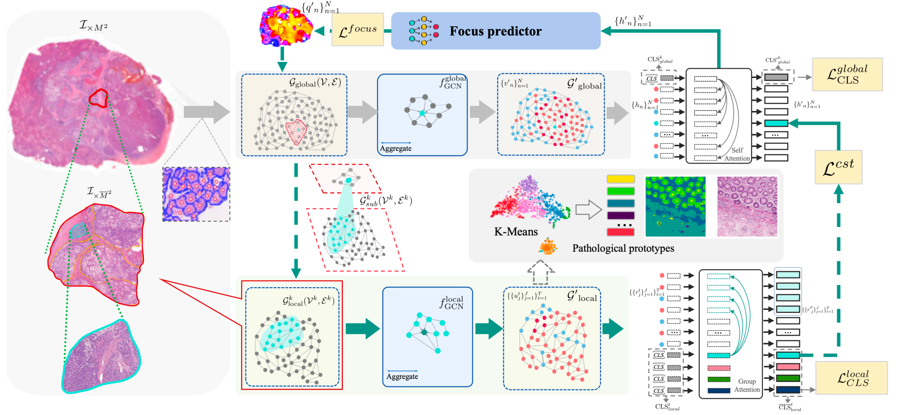
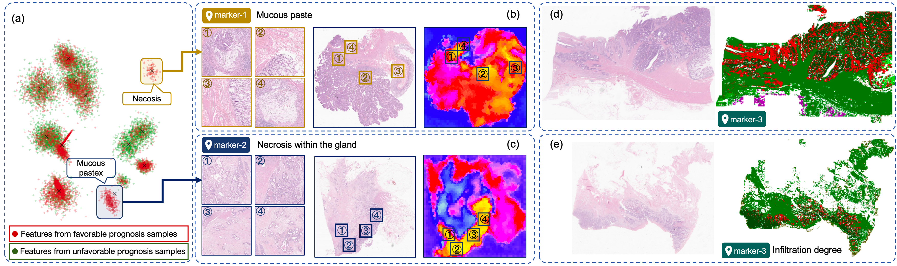
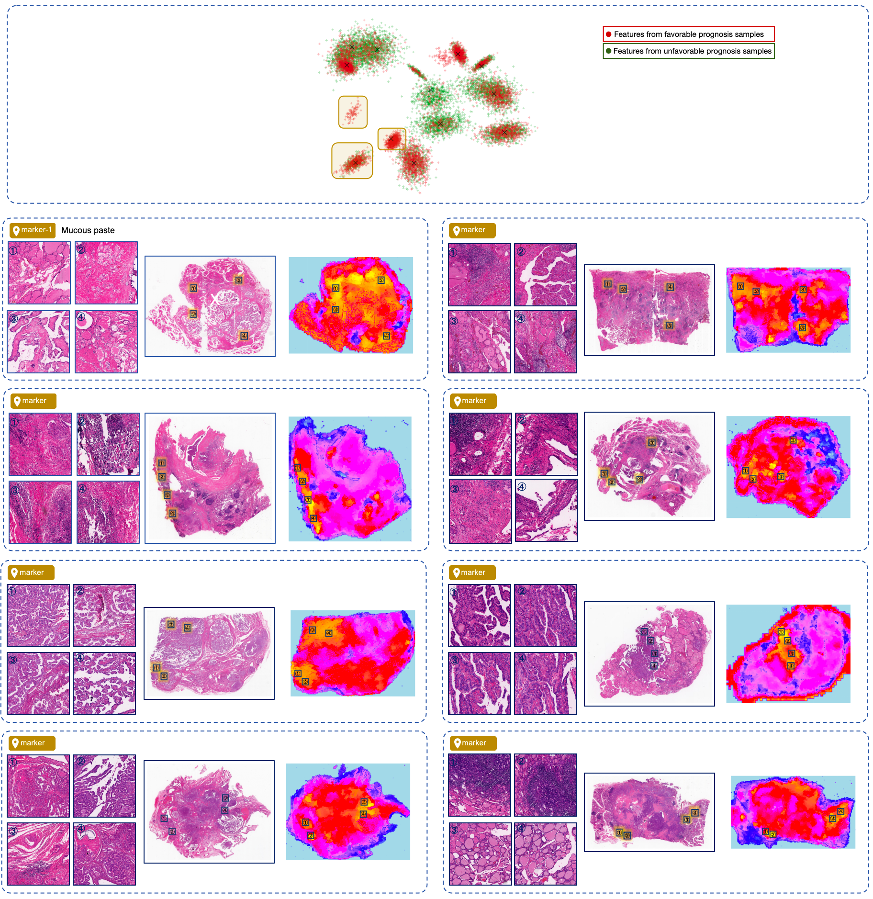

# SEW

## 1. Introduction
This repository contains code for preprocessing medical images into superpixel graphs and training a graph neural network model to classify related data. The pipeline consists of two main steps: image preprocessing and model training.

## 2. Environment Setup

### 2.1 Create a Virtual Environment
It is recommended to use a virtual environment to manage the project dependencies. You can use `conda` or `venv` to create a virtual environment. Here is an example using `conda`:
```bash
conda create -n sew python=3.8
conda activate sew
```

### 2.2 Install Dependencies
Install the necessary Python packages. You can use `pip` to install the required libraries:
```bash
pip install -r requirements.txt
```
Make sure your PyTorch version is compatible with your CUDA version if you plan to use GPU for training.

## 3. Image Preprocessing

### 3.1 Prepare Data
- Place your medical images in a directory.
- Create a CSV file named `labels.csv` (you can change the name using the `--label_csv` argument) in the destination root directory. The CSV file should have two columns: `img` (image path) and `label` (image label).
| Column Name | Description | Example |
| --- | --- | --- |
| Slide Directory | The directory where the slide images are stored. This is specified by the `--slide_root` parameter in the training script and is used for operations such as patch cropping. | `/home/lhm/mnt/medical/yxt/liverWSI/Hepatoma_2_5_years_800/` |
| Label (Prognosis or Classification) | The label represents the prognosis status (good or poor prognosis) or the classification/typing of the disease. This label is used for model training and classification. | `0` for good prognosis, `1` for poor prognosis; or `1` for Type A, `2` for Type B |
| Lesion Area Annotation | The annotation of the lesion area in the slide image. This can be in the form of coordinates, masks, or other relevant annotation information, which helps in further analysis and model training. | `[(x1, y1), (x2, y2), ...]` representing the boundary coordinates of the lesion area | 
### 3.2 Run the Preprocessing Script
The preprocessing script converts images into superpixel graphs and saves relevant graph information. You can run the script with the following command:
```bash
python preprocess.py --dst_root /path/to/destination --label_csv your_labels.csv --n_segments 3072
```
- `--dst_root`: The root directory where the processed data will be saved. Default is `/path/to/dst`.
- `--label_csv`: The path to the CSV file containing image labels. Default is `labels.csv`.
- `--n_segments`: The number of segments for superpixel segmentation. Default is 3072.

The script will create three sub - directories (`patch`, `segments`, `graph`) in the `dst_root` directory to store intermediate and final results.

## 4. Model Training

### 4.1 Configure Training Parameters
You can configure various training parameters through command - line arguments. For example:
```bash
python train.py --epochs 100 --batch_size 1 --lr1 0.001 --lr2 0.001 --lr_transformer2 0.01
```
- `--epochs`: The number of training epochs. Default is 100.
- `--batch_size`: The batch size for training. Default is 1.
- `--lr1`, `--lr2`, `--lr_transformer2`: Learning rates for different models. Default values are 0.001, 0.001, and 0.01 respectively.

## 5. Monitoring Training Progress
You can use TensorBoard to monitor the training progress. Start TensorBoard with the following command:
```bash
tensorboard --logdir=./log
```
Then open your browser and navigate to `http://localhost:6006` to view the training metrics.

## 6. Notes
- Make sure the input images can be correctly read by OpenCV. If an image fails to be read, an error message will be printed.
- If you encounter any issues during the installation or running process, check the error messages carefully and refer to the documentation of the corresponding libraries.
- The superpixel tokens encoded by SEW have excellent prognostic analysis performance, and we can use them to discover prognostic markers.

